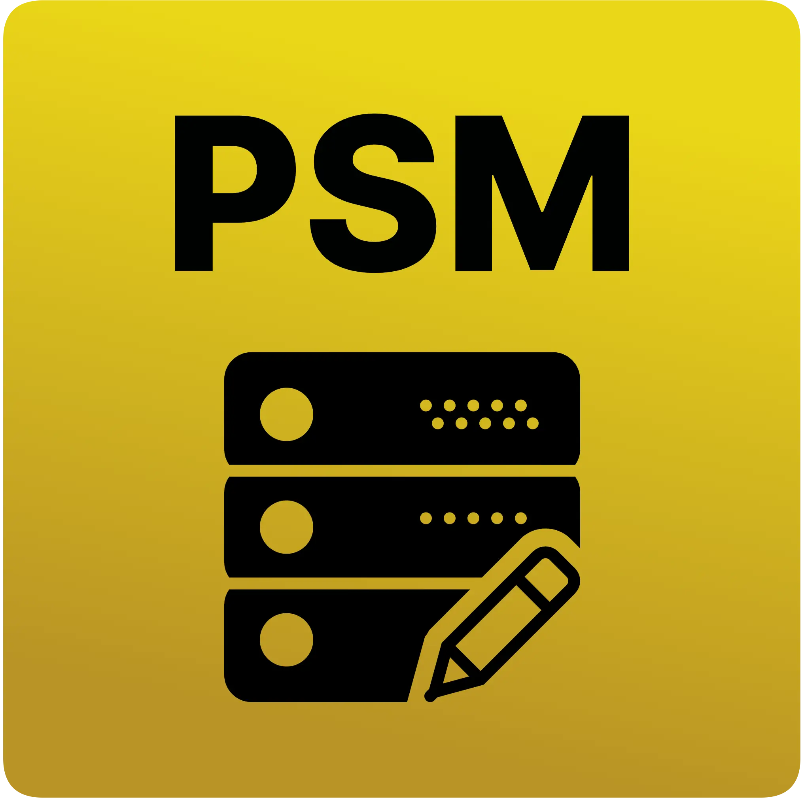

   

<h1 align='center'>
  Pes 6 server manager
  </h1>

## :book: Description :book:
  Pes6 server manager helps its users to be able to have control of the servers where they play. In this way, with a few simple clicks, play PES 6 on the server of your choice. :shipit::computer::soccer: